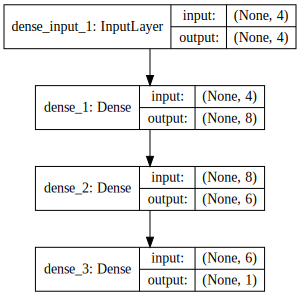
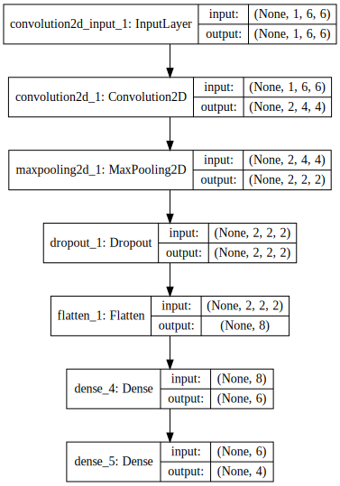

```python
import numpy
from keras.models import Sequential
from keras.layers import Dense
from keras.layers import Dropout
from keras.layers import Flatten
from keras.layers.convolutional import Convolution2D
from keras.layers.convolutional import MaxPooling2D
from keras.utils import np_utils

import numpy

from IPython.display import SVG
from keras.utils.visualize_util import model_to_dot
```

    Using Theano backend.


---

# Dense

전결합층은 'Dense' 클래스로 나타낼 수 있다. 

> model.add(Dense(8, input_dim=4, init='uniform', activation='relu'))

* input_dim : 입력되는 입력 뉴런의 수
* init : 초기화 방법
    * uniform : 균일 분포
    * normal : 가우신안 분포
    * lecun_uniform: Uniform initialization scaled by the square root of the number of inputs (LeCun 98).
    * identity: Use with square 2D layers (shape[0] == shape[1]).
    * orthogonal: Use with square 2D layers (shape[0] == shape[1]).
    * zero
    * one
    * glorot_normal: Gaussian initialization scaled by fan_in + fan_out (Glorot 2010)
    * glorot_uniform
    * he_normal: Gaussian initialization scaled by fan_in (He et al., 2014)
    * he_uniform
* activation : 활성화 함수 지정
    * relu : rectifier 함수, 은익층에 주로 쓰임
    * sigmoid : 시그모이드 함수, 출력층에 주로 쓰임
    * softmax : 소프트맥스 함수, 출력층에 주로 쓰임
    * tanh
    * softplus
    * softsign
    * hard_sigmoid
    * linear
    * LeakyReLU
    * PReLU
    * ELU
    * ParametricSoftplus
    * ThresholdedReLU
    * SReLU


```python
model = Sequential()

model.add(Dense(8, input_dim=4, init='uniform', activation='relu'))
model.add(Dense(6, init='uniform', activation='relu'))
model.add(Dense(1, init='uniform', activation='sigmoid'))

SVG(model_to_dot(model, show_shapes=True).create(prog='dot', format='svg'))
```





```python
# create model
model = Sequential()
model.add(Convolution2D(2, 3, 3, border_mode='valid', input_shape=(1, 6, 6), activation='relu'))
model.add(MaxPooling2D(pool_size=(2, 2)))
model.add(Dropout(0.2))
model.add(Flatten())
model.add(Dense(6, activation='relu'))
model.add(Dense(4, activation='softmax'))

SVG(model_to_dot(model, show_shapes=True).create(prog='dot', format='svg'))
```





```python

```
