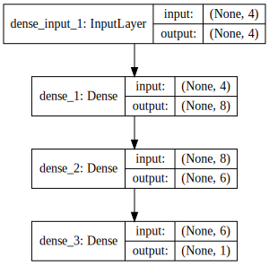

이번에는 케라스에서 사용되는 레이어(layer, 층) 개념에 대해서 알아봅니다. 케라스의 핵심 데이터 구조는 모델이고, 이 모델을 구성하는 것이 레이어입니다. 주요 레이어에 대해 기본 개념, 역할 등에 대해서 살펴보고, 레이어를 어떻게 쌓아서 모델을 만들 수 있는 지 알아봅니다. 기본적인 레이어 개념을 익히면 레고 쌓는 것 처럼 쉽게 구성할 수 있는데, 실제 레고로도 쌓아보겠습니다. 본 강좌에서는 다층 퍼셉트론 모델에서 사용되는 Dense 레이어에 대해서만 알아보겠습니다.

---

### 입출력을 모두 연결해주는 Dense 레이어

Dense 레이어는 입력과 출력을 모두 연결해줍니다. 예를 들어 입력 뉴런이 4개, 출력 뉴런이 8개있다면 총 연결선은 32개(4*8=32) 입니다. 이를 그림으로 표시하면 다음과 같습니다. 

각 연결선에는 가중치(weight)를 포함하고 있는데, 이 가중치가 나타내는 의미는 연결강도라고 보시면 됩니다. 현재 연결선이 32개이므로 가중치도 32개입니다.

> 가중치가 높을수록 해당 입력 뉴런이 출력 뉴런에 미치는 영향이 크고, 낮을수록 미치는 영향이 적다.

예를 들어 성별을 판단하는 문제있어서, 출력 뉴런의 값이 성별을 의미하고, 입력 뉴런에 머리카락길이, 키, 혈핵형 등이 있다고 가정했을 때, 머리카락길이의 가중치가 가장 높고, 키의 가중치가 중간이고, 혈핵형의 가중치가 가장 낮을 겁니다. 딥러닝 학습과정에서 이러한 가중치들이 조정됩니다.

이렇게 입력 뉴런과 출력 뉴런을 모두 연결한다고 해서 전결합층이라고 불리고, 케라스에서는 Dense라는 클래스로 구현이 되어 있습니다. 아래는 Dense 클래스 사용 예제입니다.

    Dense(8, input_dim=4, init='uniform', activation='relu'))

주요 인자는 다음과 같습니다.
* 첫번째 인자 : 출력 뉴런의 수
* input_dim : 입력 뉴런의 수
* init : 가중치 초기화 방법 설정
    * uniform : 균일 분포
    * normal : 가우시안 분포
* activation : 활성화 함수 설정
    * linear : 디폴트 값, 입력뉴런과 가중치로 계산된 결과값이 그대로 출력으로 나옴
    * relu : rectifier 함수, 은익층에 주로 쓰임
    * sigmoid : 시그모이드 함수, 이진 분류 문제에서 출력층에 주로 쓰임
    * softmax : 소프트맥스 함수, 다중 클래스 분류 문제에서 출력층에 주로 쓰임

Dense 레이어는 입력 뉴런 수에 상관없이 출력 뉴런 수를 자유롭게 설정할 수 있기 때문에 출력층으로 많이 사용됩니다. 이진 분류문제에서는 0과 1을 나타내는 출력 뉴런이 하나만 있으면 되기 때문에 아래 코드처럼 출력 뉴런이 1개이고, 입력 뉴런과 가중치를 계산한 값을 0에서 1사이로 표현할 수 있는 활성화 함수인 sigmoid을 사용합니다.

    Dense(1, input_dim=3, activation='sigmoid'))

다중클래스 분류문제에서는 클래스 수만큼 출력 뉴런이 필요합니다. 만약 세가지 종류로 분류한다면, 아래 코드처럼 출력 뉴런이 3개이고, 입력 뉴련과 가중치를 계산한 값을 각 클래스의 확률 개념으로 표현할 수 있는 활성화 함수인 sofemax를 사용합니다.

    Dense(3, input_dim=6, activation='softmax'))

Dense 레이어는 보통 출력층 이전의 은닉층으로도 많이 쓰이고, 영상이 아닌 수치자료 입력 시에는 입력층으로도 많이 쓰입니다. 이 때 활성화 함수로 'relu'가 주로 사용됩니다. 'relu'는 학습과정에서 역전파 시에 좋은 성능이 나는 것으로 알려져 있습니다.

    Dense(6, input_dim = 4, activation='relu'))

또한 입력층이 아닐 때에는 이전층의 출력 뉴런 수를 알 수 있기 때문에 input_dim을 지정하지 않아도 됩니다. 아래 코드를 보면, 입력층에만 input_dim을 정의하였고, 이후 층에서는 input_dim을 지정하지 않았습니다.

    model.add(Dense(8, input_dim=4, init='uniform', activation='relu'))
    model.add(Dense(6, init='uniform', activation='relu'))
    model.add(Dense(1, init='uniform', activation='sigmoid'))


```python
import numpy
from keras.models import Sequential
from keras.layers import Dense
from keras.layers import Dropout
from keras.layers import Flatten
from keras.layers.convolutional import Convolution2D
from keras.layers.convolutional import MaxPooling2D
from keras.utils import np_utils

import numpy

from IPython.display import SVG
from keras.utils.visualize_util import model_to_dot
```

    Using Theano backend.


```python
model = Sequential()

model.add(Dense(8, input_dim=4, init='uniform', activation='relu'))
model.add(Dense(6, init='uniform', activation='relu'))
model.add(Dense(1, init='uniform', activation='sigmoid'))

SVG(model_to_dot(model, show_shapes=True).create(prog='dot', format='svg'))
```





---

### 같이 보기

* [강좌 목차](https://tykimos.github.io/Keras/2017/01/27/Keras_Lecture_Contents/)
* 이전 : [딥러닝 이야기/케라스 이야기](https://tykimos.github.io/Keras/2017/01/27/Keras_Talk/)
* 다음 : [딥러닝 이야기/컨볼루션 신경망 레이어 이야기]


```python

```
