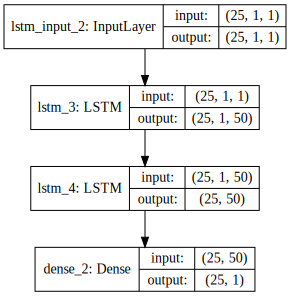
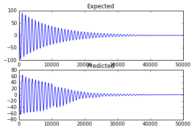

본 강좌에서는 간단한 순환 신경망 모델을 만들어봅니다. Example script showing how to use stateful RNNs
to model long sequences efficiently. 늘 그렇듯이 다음과 같은 순서로 진행하겠습니다.

1. 데이터셋 준비하기
1. 모델 구성하기
1. 모델 엮기
1. 모델 학습시키기
1. 모델 사용하기

---

### 데이터셋 준비하기

Generates an absolute cosine time series with the amplitude exponentially decreasing
Arguments:
    amp: amplitude of the cosine function
    period: period of the cosine function
    x0: initial x of the time series
    xn: final x of the time series
    step: step of the time series discretization
    k: exponential rate


```python
from __future__ import print_function
import numpy as np
import matplotlib.pyplot as plt
%matplotlib inline  

# since we are using stateful rnn tsteps can be set to 1
tsteps = 1
batch_size = 25
epochs = 25
# number of elements ahead that are used to make the prediction
lahead = 1

def gen_cosine_amp(amp=100, period=1000, x0=0, xn=50000, step=1, k=0.0001):
    """Generates an absolute cosine time series with the amplitude
    exponentially decreasing
    Arguments:
        amp: amplitude of the cosine function
        period: period of the cosine function
        x0: initial x of the time series
        xn: final x of the time series
        step: step of the time series discretization
        k: exponential rate
    """
    cos = np.zeros(((xn - x0) * step, 1, 1))
    for i in range(len(cos)):
        idx = x0 + i * step
        cos[i, 0, 0] = amp * np.cos(2 * np.pi * idx / period)
        cos[i, 0, 0] = cos[i, 0, 0] * np.exp(-k * idx)
    return cos

print('Generating Data')
cos = gen_cosine_amp()
print('Input shape:', cos.shape)

expected_output = np.zeros((len(cos), 1))
for i in range(len(cos) - lahead):
    expected_output[i, 0] = np.mean(cos[i + 1:i + lahead + 1])

print('Output shape')
print(expected_output.shape)
```

    Generating Data
    Input shape: (50000, 1, 1)
    Output shape
    (50000, 1)


---

### 모델 구성하기


```python
from keras.models import Sequential
from keras.layers import Dense, LSTM

# Create model

model = Sequential()
model.add(LSTM(50,
               batch_input_shape=(batch_size, tsteps, 1),
               return_sequences=True,
               stateful=True))
model.add(LSTM(50,
               return_sequences=False,
               stateful=True))
model.add(Dense(1))
```


```python
from IPython.display import SVG
from keras.utils.visualize_util import model_to_dot

# brew install graphviz
# pip uninstall -y pydot
# pip install pydot-ng

SVG(model_to_dot(model, show_shapes=True).create(prog='dot', format='svg'))
```





### 모델 엮기

컴파일 시에 정의해야하는 것들
- 가중치 세트를 평가하는 데 사용할 손실함수(loss function)
 - binary_crossentropy : 이진 분류를 위한 logarithmic loss
- 네트워크의 다른 가중치를 검객하는 데 사용되는 최적화 알고리즘
 - adam : 효율적인 경사 하강법(gradient descent) 알고리즘
- 학습과정에서 수집하기 싶은 측정 기준


```python
# Compile model
model.compile(loss='mse', optimizer='rmsprop')
```

### 모델 학습시키기

- nb_epoch : 데이터셋에 대한 반복 횟수
- batch_size : 네트워크에서 가중치 개갱신 전에 평가되는 인스턴스의 수


```python
# Fit the model

print('Training')
for i in range(epochs):
    print('Epoch', i, '/', epochs)
    model.fit(cos,
              expected_output,
              batch_size=batch_size,
              verbose=1,
              nb_epoch=1,
              shuffle=False)
    model.reset_states()
```

    Training
    Epoch 0 / 25
    Epoch 1/1
    50000/50000 [==============================] - 4s - loss: 333.8799     
    Epoch 1 / 25
    Epoch 1/1
    50000/50000 [==============================] - 4s - loss: 145.0289     
    Epoch 2 / 25
    Epoch 1/1
    50000/50000 [==============================] - 4s - loss: 79.0348     
    Epoch 3 / 25
    Epoch 1/1
    50000/50000 [==============================] - 4s - loss: 47.4840     
    Epoch 4 / 25
    Epoch 1/1
    50000/50000 [==============================] - 4s - loss: 29.9804     
    Epoch 5 / 25
    Epoch 1/1
    50000/50000 [==============================] - 4s - loss: 22.1359     
    Epoch 6 / 25
    Epoch 1/1
    50000/50000 [==============================] - 4s - loss: 16.1997     
    Epoch 7 / 25
    Epoch 1/1
    50000/50000 [==============================] - 4s - loss: 13.6479     
    Epoch 8 / 25
    Epoch 1/1
    50000/50000 [==============================] - 5s - loss: 13.1759     
    Epoch 9 / 25
    Epoch 1/1
    50000/50000 [==============================] - 5s - loss: 11.5702     
    Epoch 10 / 25
    Epoch 1/1
    50000/50000 [==============================] - 5s - loss: 8.0647     
    Epoch 11 / 25
    Epoch 1/1
    50000/50000 [==============================] - 5s - loss: 7.7706     
    Epoch 12 / 25
    Epoch 1/1
    50000/50000 [==============================] - 5s - loss: 7.0166     
    Epoch 13 / 25
    Epoch 1/1
    50000/50000 [==============================] - 5s - loss: 8.1204     
    Epoch 14 / 25
    Epoch 1/1
    50000/50000 [==============================] - 5s - loss: 8.2418     
    Epoch 15 / 25
    Epoch 1/1
    50000/50000 [==============================] - 5s - loss: 7.5997     
    Epoch 16 / 25
    Epoch 1/1
    50000/50000 [==============================] - 5s - loss: 10.3045     
    Epoch 17 / 25
    Epoch 1/1
    50000/50000 [==============================] - 5s - loss: 13.4392     
    Epoch 18 / 25
    Epoch 1/1
    50000/50000 [==============================] - 5s - loss: 8.3691     
    Epoch 19 / 25
    Epoch 1/1
    50000/50000 [==============================] - 5s - loss: 7.3953     
    Epoch 20 / 25
    Epoch 1/1
    50000/50000 [==============================] - 5s - loss: 6.4549     
    Epoch 21 / 25
    Epoch 1/1
    50000/50000 [==============================] - 5s - loss: 7.7071     
    Epoch 22 / 25
    Epoch 1/1
    50000/50000 [==============================] - 6s - loss: 4.9991     
    Epoch 23 / 25
    Epoch 1/1
    50000/50000 [==============================] - 6s - loss: 4.7767     
    Epoch 24 / 25
    Epoch 1/1
    50000/50000 [==============================] - 6s - loss: 9.6175     


---

### 모델 사용하기


```python
# evaliuate

print('Predicting')
predicted_output = model.predict(cos, batch_size=batch_size)

print('Plotting Results')
plt.subplot(2, 1, 1)
plt.plot(expected_output)
plt.title('Expected')
plt.subplot(2, 1, 2)
plt.plot(predicted_output)
plt.title('Predicted')
plt.show()
```

    Predicting
    Plotting Results





---

### 같이 보기

* [강좌 목차](https://tykimos.github.io/Keras/2017/01/27/Keras_Lecture_Plan/)
* 이전 : [딥러닝 기본 실습/다층 퍼셉트론 모델 만들어보기](https://tykimos.github.io/Keras/2017/02/04/MLP_Getting_Started/)
* 다음 : [딥러닝 기본 실습/오토인코더 모델 만들어보기](https://tykimos.github.io/Keras/2017/02/04/AutoEncoder_Getting_Started/)


```python

```
