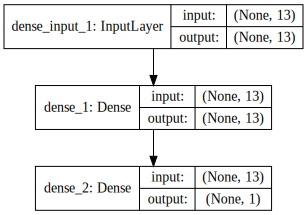

본 강좌에서는 회귀(regression)을 다층 퍼셉트론으로 해보겠습니다. 다음과 같은 순서로 진행하겠습니다.

1. 데이터셋 준비하기
1. 모델 구성하기
1. 모델 엮기
1. 모델 학습시키기
1. 모델 사용하기

---

### 데이터셋 준비하기

The problem that we will look at in this tutorial is the Boston house price dataset. The dataset describes properties of houses in Boston suburbs and is concerned with modeling the price of houses in those suburbs in thousands of dollars. As such, this is a regression predictive modeling problem. There are 13 input variables that describe the properties of a given Boston suburb. The full list of attributes in this dataset are as follows:

1. CRIM: per capita crime rate by town.
2. ZN: proportion of residential land zoned for lots over 25,000 sq.ft.
3. INDUS: proportion of non-retail business acres per town.
4. CHAS: Charles River dummy variable (= 1 if tract bounds river; 0 otherwise). 5. NOX: nitric oxides concentration (parts per 10 million).
6. RM: average number of rooms per dwelling.
7. AGE: proportion of owner-occupied units built prior to 1940. 8. DIS: weighted distances to five Boston employment centers. 9. RAD: index of accessibility to radial highways.
10. TAX: full-value property-tax rate per 10,000.
11. PTRATIO: pupil-teacher ratio by town.
12. B: 1000(Bk   0.63)2 where Bk is the proportion of blacks by town. 13. LSTAT: % lower status of the population.
14. MEDV: Median value of owner-occupied homes in   1000s.

데이터셋 샘플

    0.00632 18.00 2.310 0 0.5380 6.5750 65.20 4.0900 1 296.0 15.30 396.90 4.98 24.00 
    0.02731 0.00 7.070 0 0.4690 6.4210 78.90 4.9671 2 242.0 17.80 396.90 9.14 21.60 
    0.02729 0.00 7.070 0 0.4690 7.1850 61.10 4.9671 2 242.0 17.80 392.83 4.03 34.70 
    0.03237 0.00 2.180 0 0.4580 6.9980 45.80 6.0622 3 222.0 18.70 394.63 2.94 33.40 
    0.06905 0.00 2.180 0 0.4580 7.1470 54.20 6.0622 3 222.0 18.70 396.90 5.33 36.20

[설명](https://archive.ics.uci.edu/ml/datasets/Housing)
[다운](https://archive.ics.uci.edu/ml/machine-learning-databases/housing/housing.data)


```python
# Regression Example With Boston Dataset: Baseline
import numpy
import pandas
from keras.models import Sequential
from keras.layers import Dense

# fix random seed for reproducibility
seed = 7
numpy.random.seed(seed)
```


```python
# load dataset
dataframe = pandas.read_csv("housing.data", delim_whitespace=True, header=None)
dataset = dataframe.values
# split into input (X) and output (Y) variables
X = dataset[:,0:13]
Y = dataset[:,13]
```

---

### 모델 구성하기

Dense 클래스를 사용하여 완전 연결 레이어(Fully Connected Layer)를 정의할 수 있다.

- 첫번째 인자 : 뉴런의 수
- 두번째 인자 : 네트워크 가중치(network weight) 초기화 방법
 - uniform : 균등분포 (uniform distribution)의 작은 난수들로 초기화 (0~0.05 사이)
 - normal : 가우시안 분포 (Gaussian distribution)로 생성된 작은 난수들로 초기화 
- 세번째 인자 : 활성화 함수(activation function) 지정
 - relu : rectifier 활성화 함수
 - sigmoid : sigmoid 활성화 함수
 - tanh : tanh 활성화 함수
 
마지막 레이어는 sigmoid 할성화 함수를 사용하는데, 이유는 결과가 0과 1사이로 나오는 것을 보장하며, 양성 클래스의 확률로 쉽게 매핑할 수 있기 때문이다. 또한 0.5 임계치(threshold)을 같은 클래스의 범주형 분류(hard classification)를 할 수 있다.

- 첫번째 은닉층(hidden layer)는 12개 뉴런을 가지고, 8개 입력을 받아들인다.
- 두번째 은닉층은 8개 뉴런을 가진다.
- 마지막 레이어는 클래스를 예측하는 1개의 뉴런을 가진다.


```python
# create model
model = Sequential()
model.add(Dense(13, input_dim=13, init='normal', activation='relu'))
model.add(Dense(1, init='normal'))
```


```python
from IPython.display import SVG
from keras.utils.visualize_util import model_to_dot

SVG(model_to_dot(model, show_shapes=True).create(prog='dot', format='svg'))
```





---

### 모델 엮기

컴파일 시에 정의해야하는 것들
- 가중치 세트를 평가하는 데 사용할 손실함수(loss function)
 - binary_crossentropy : 이진 분류를 위한 logarithmic loss
- 네트워크의 다른 가중치를 검객하는 데 사용되는 최적화 알고리즘
 - adam : 효율적인 경사 하강법(gradient descent) 알고리즘
- 학습과정에서 수집하기 싶은 측정 기준


```python
# Compile model
model.compile(loss='mean_squared_error', optimizer='adam')
```

---

### 모델 학습시키기

- nb_epoch : 데이터셋에 대한 반복 횟수
- batch_size : 네트워크에서 가중치 개갱신 전에 평가되는 인스턴스의 수


```python
# Fit the model
model.fit(X, Y, nb_epoch=100, batch_size=5) # nb_epoch 150
```

    Epoch 1/100
    506/506 [==============================] - 0s - loss: 220.6010     
    Epoch 2/100
    506/506 [==============================] - 0s - loss: 94.9614     
    Epoch 3/100
    506/506 [==============================] - 0s - loss: 74.4544     
    Epoch 4/100
    506/506 [==============================] - 0s - loss: 70.1266     
    Epoch 5/100
    506/506 [==============================] - 0s - loss: 65.2087     
    Epoch 6/100
    506/506 [==============================] - 0s - loss: 59.9777     
    Epoch 7/100
    506/506 [==============================] - 0s - loss: 56.8604     
    Epoch 8/100
    506/506 [==============================] - 0s - loss: 54.5600     
    Epoch 9/100
    506/506 [==============================] - 0s - loss: 53.4545     
    Epoch 10/100
    506/506 [==============================] - 0s - loss: 50.1894     
    Epoch 11/100
    506/506 [==============================] - 0s - loss: 48.5082     
    Epoch 12/100
    506/506 [==============================] - 0s - loss: 45.8188     
    Epoch 13/100
    506/506 [==============================] - 0s - loss: 44.1205     
    Epoch 14/100
    506/506 [==============================] - 0s - loss: 43.4843     
    Epoch 15/100
    506/506 [==============================] - 0s - loss: 41.5679     
    Epoch 16/100
    506/506 [==============================] - 0s - loss: 40.3484     
    Epoch 17/100
    506/506 [==============================] - 0s - loss: 39.1555     
    Epoch 18/100
    506/506 [==============================] - 0s - loss: 39.2184     
    Epoch 19/100
    506/506 [==============================] - 0s - loss: 39.3879     
    Epoch 20/100
    506/506 [==============================] - 0s - loss: 37.0142     
    Epoch 21/100
    506/506 [==============================] - 0s - loss: 37.1262     
    Epoch 22/100
    506/506 [==============================] - 0s - loss: 35.5424     
    Epoch 23/100
    506/506 [==============================] - 0s - loss: 36.9168     
    Epoch 24/100
    506/506 [==============================] - 0s - loss: 36.2799     
    Epoch 25/100
    506/506 [==============================] - 0s - loss: 35.7161     
    Epoch 26/100
    506/506 [==============================] - 0s - loss: 34.1402     
    Epoch 27/100
    506/506 [==============================] - 0s - loss: 33.9518     
    Epoch 28/100
    506/506 [==============================] - 0s - loss: 33.7178     
    Epoch 29/100
    506/506 [==============================] - 0s - loss: 34.7991     
    Epoch 30/100
    506/506 [==============================] - 0s - loss: 33.0659     
    Epoch 31/100
    506/506 [==============================] - 0s - loss: 33.3723     
    Epoch 32/100
    506/506 [==============================] - 0s - loss: 33.0732     
    Epoch 33/100
    506/506 [==============================] - 0s - loss: 32.7766     
    Epoch 34/100
    506/506 [==============================] - 0s - loss: 33.2593     
    Epoch 35/100
    506/506 [==============================] - 0s - loss: 34.2216     
    Epoch 36/100
    506/506 [==============================] - 0s - loss: 33.0432     
    Epoch 37/100
    506/506 [==============================] - 0s - loss: 31.6306     
    Epoch 38/100
    506/506 [==============================] - 0s - loss: 31.0291     
    Epoch 39/100
    506/506 [==============================] - 0s - loss: 31.3950     
    Epoch 40/100
    506/506 [==============================] - 0s - loss: 31.7122     
    Epoch 41/100
    506/506 [==============================] - 0s - loss: 31.2313     
    Epoch 42/100
    506/506 [==============================] - 0s - loss: 32.5598     
    Epoch 43/100
    506/506 [==============================] - 0s - loss: 30.4881     
    Epoch 44/100
    506/506 [==============================] - 0s - loss: 30.0750     
    Epoch 45/100
    506/506 [==============================] - 0s - loss: 29.6042     
    Epoch 46/100
    506/506 [==============================] - 0s - loss: 29.4660     
    Epoch 47/100
    506/506 [==============================] - 0s - loss: 29.6849     
    Epoch 48/100
    506/506 [==============================] - 0s - loss: 30.9019     
    Epoch 49/100
    506/506 [==============================] - 0s - loss: 28.8761     
    Epoch 50/100
    506/506 [==============================] - 0s - loss: 27.8490     
    Epoch 51/100
    506/506 [==============================] - 0s - loss: 28.2554     
    Epoch 52/100
    506/506 [==============================] - 0s - loss: 27.3966     
    Epoch 53/100
    506/506 [==============================] - 0s - loss: 26.8454     
    Epoch 54/100
    506/506 [==============================] - 0s - loss: 27.3646     
    Epoch 55/100
    506/506 [==============================] - 0s - loss: 25.8444     
    Epoch 56/100
    506/506 [==============================] - 0s - loss: 27.4372     
    Epoch 57/100
    506/506 [==============================] - 0s - loss: 26.0891     
    Epoch 58/100
    506/506 [==============================] - 0s - loss: 25.5716     
    Epoch 59/100
    506/506 [==============================] - 0s - loss: 26.4421     
    Epoch 60/100
    506/506 [==============================] - 0s - loss: 25.8178     
    Epoch 61/100
    506/506 [==============================] - 0s - loss: 24.4050     
    Epoch 62/100
    506/506 [==============================] - 0s - loss: 24.7970     
    Epoch 63/100
    506/506 [==============================] - 0s - loss: 23.6971     
    Epoch 64/100
    506/506 [==============================] - 0s - loss: 23.8202     
    Epoch 65/100
    506/506 [==============================] - 0s - loss: 25.2138     
    Epoch 66/100
    506/506 [==============================] - 0s - loss: 23.8915     
    Epoch 67/100
    506/506 [==============================] - 0s - loss: 23.1451     
    Epoch 68/100
    506/506 [==============================] - 0s - loss: 23.7634     
    Epoch 69/100
    506/506 [==============================] - 0s - loss: 22.5181     
    Epoch 70/100
    506/506 [==============================] - 0s - loss: 22.3209     
    Epoch 71/100
    506/506 [==============================] - 0s - loss: 21.9905     
    Epoch 72/100
    506/506 [==============================] - 0s - loss: 22.2115     
    Epoch 73/100
    506/506 [==============================] - 0s - loss: 21.6302     
    Epoch 74/100
    506/506 [==============================] - 0s - loss: 22.1323     
    Epoch 75/100
    506/506 [==============================] - 0s - loss: 22.7296     
    Epoch 76/100
    506/506 [==============================] - 0s - loss: 22.4889     
    Epoch 77/100
    506/506 [==============================] - 0s - loss: 21.6615     
    Epoch 78/100
    506/506 [==============================] - 0s - loss: 21.1699     
    Epoch 79/100
    506/506 [==============================] - 0s - loss: 21.7719     
    Epoch 80/100
    506/506 [==============================] - 0s - loss: 20.3358     
    Epoch 81/100
    506/506 [==============================] - 0s - loss: 20.5675     
    Epoch 82/100
    506/506 [==============================] - 0s - loss: 20.4599     
    Epoch 83/100
    506/506 [==============================] - 0s - loss: 20.7807     
    Epoch 84/100
    506/506 [==============================] - 0s - loss: 21.3357     
    Epoch 85/100
    506/506 [==============================] - 0s - loss: 20.2724     
    Epoch 86/100
    506/506 [==============================] - 0s - loss: 20.1282     
    Epoch 87/100
    506/506 [==============================] - 0s - loss: 20.5625     
    Epoch 88/100
    506/506 [==============================] - 0s - loss: 20.4694     
    Epoch 89/100
    506/506 [==============================] - 0s - loss: 19.7502     
    Epoch 90/100
    506/506 [==============================] - 0s - loss: 19.5938     
    Epoch 91/100
    506/506 [==============================] - 0s - loss: 20.5313     
    Epoch 92/100
    506/506 [==============================] - 0s - loss: 19.8708     
    Epoch 93/100
    506/506 [==============================] - 0s - loss: 19.4989     
    Epoch 94/100
    506/506 [==============================] - 0s - loss: 19.2255     
    Epoch 95/100
    506/506 [==============================] - 0s - loss: 20.3392     
    Epoch 96/100
    506/506 [==============================] - 0s - loss: 19.0932     
    Epoch 97/100
    506/506 [==============================] - 0s - loss: 20.6451     
    Epoch 98/100
    506/506 [==============================] - 0s - loss: 20.4577     
    Epoch 99/100
    506/506 [==============================] - 0s - loss: 19.0432     
    Epoch 100/100
    506/506 [==============================] - 0s - loss: 18.7827     


    <keras.callbacks.History at 0x1115c6490>


---

### 모델 사용하기


```python
# evaliuate
scores = model.evaluate(X, Y)

print(" MSE : %.2f" %(scores))
```

     32/506 [>.............................] - ETA: 0s MSE : 17.42


```python
scores
```


    17.420470452591363


```python
Y
```


    array([ 24. ,  21.6,  34.7,  33.4,  36.2,  28.7,  22.9,  27.1,  16.5,
            18.9,  15. ,  18.9,  21.7,  20.4,  18.2,  19.9,  23.1,  17.5,
            20.2,  18.2,  13.6,  19.6,  15.2,  14.5,  15.6,  13.9,  16.6,
            14.8,  18.4,  21. ,  12.7,  14.5,  13.2,  13.1,  13.5,  18.9,
            20. ,  21. ,  24.7,  30.8,  34.9,  26.6,  25.3,  24.7,  21.2,
            19.3,  20. ,  16.6,  14.4,  19.4,  19.7,  20.5,  25. ,  23.4,
            18.9,  35.4,  24.7,  31.6,  23.3,  19.6,  18.7,  16. ,  22.2,
            25. ,  33. ,  23.5,  19.4,  22. ,  17.4,  20.9,  24.2,  21.7,
            22.8,  23.4,  24.1,  21.4,  20. ,  20.8,  21.2,  20.3,  28. ,
            23.9,  24.8,  22.9,  23.9,  26.6,  22.5,  22.2,  23.6,  28.7,
            22.6,  22. ,  22.9,  25. ,  20.6,  28.4,  21.4,  38.7,  43.8,
            33.2,  27.5,  26.5,  18.6,  19.3,  20.1,  19.5,  19.5,  20.4,
            19.8,  19.4,  21.7,  22.8,  18.8,  18.7,  18.5,  18.3,  21.2,
            19.2,  20.4,  19.3,  22. ,  20.3,  20.5,  17.3,  18.8,  21.4,
            15.7,  16.2,  18. ,  14.3,  19.2,  19.6,  23. ,  18.4,  15.6,
            18.1,  17.4,  17.1,  13.3,  17.8,  14. ,  14.4,  13.4,  15.6,
            11.8,  13.8,  15.6,  14.6,  17.8,  15.4,  21.5,  19.6,  15.3,
            19.4,  17. ,  15.6,  13.1,  41.3,  24.3,  23.3,  27. ,  50. ,
            50. ,  50. ,  22.7,  25. ,  50. ,  23.8,  23.8,  22.3,  17.4,
            19.1,  23.1,  23.6,  22.6,  29.4,  23.2,  24.6,  29.9,  37.2,
            39.8,  36.2,  37.9,  32.5,  26.4,  29.6,  50. ,  32. ,  29.8,
            34.9,  37. ,  30.5,  36.4,  31.1,  29.1,  50. ,  33.3,  30.3,
            34.6,  34.9,  32.9,  24.1,  42.3,  48.5,  50. ,  22.6,  24.4,
            22.5,  24.4,  20. ,  21.7,  19.3,  22.4,  28.1,  23.7,  25. ,
            23.3,  28.7,  21.5,  23. ,  26.7,  21.7,  27.5,  30.1,  44.8,
            50. ,  37.6,  31.6,  46.7,  31.5,  24.3,  31.7,  41.7,  48.3,
            29. ,  24. ,  25.1,  31.5,  23.7,  23.3,  22. ,  20.1,  22.2,
            23.7,  17.6,  18.5,  24.3,  20.5,  24.5,  26.2,  24.4,  24.8,
            29.6,  42.8,  21.9,  20.9,  44. ,  50. ,  36. ,  30.1,  33.8,
            43.1,  48.8,  31. ,  36.5,  22.8,  30.7,  50. ,  43.5,  20.7,
            21.1,  25.2,  24.4,  35.2,  32.4,  32. ,  33.2,  33.1,  29.1,
            35.1,  45.4,  35.4,  46. ,  50. ,  32.2,  22. ,  20.1,  23.2,
            22.3,  24.8,  28.5,  37.3,  27.9,  23.9,  21.7,  28.6,  27.1,
            20.3,  22.5,  29. ,  24.8,  22. ,  26.4,  33.1,  36.1,  28.4,
            33.4,  28.2,  22.8,  20.3,  16.1,  22.1,  19.4,  21.6,  23.8,
            16.2,  17.8,  19.8,  23.1,  21. ,  23.8,  23.1,  20.4,  18.5,
            25. ,  24.6,  23. ,  22.2,  19.3,  22.6,  19.8,  17.1,  19.4,
            22.2,  20.7,  21.1,  19.5,  18.5,  20.6,  19. ,  18.7,  32.7,
            16.5,  23.9,  31.2,  17.5,  17.2,  23.1,  24.5,  26.6,  22.9,
            24.1,  18.6,  30.1,  18.2,  20.6,  17.8,  21.7,  22.7,  22.6,
            25. ,  19.9,  20.8,  16.8,  21.9,  27.5,  21.9,  23.1,  50. ,
            50. ,  50. ,  50. ,  50. ,  13.8,  13.8,  15. ,  13.9,  13.3,
            13.1,  10.2,  10.4,  10.9,  11.3,  12.3,   8.8,   7.2,  10.5,
             7.4,  10.2,  11.5,  15.1,  23.2,   9.7,  13.8,  12.7,  13.1,
            12.5,   8.5,   5. ,   6.3,   5.6,   7.2,  12.1,   8.3,   8.5,
             5. ,  11.9,  27.9,  17.2,  27.5,  15. ,  17.2,  17.9,  16.3,
             7. ,   7.2,   7.5,  10.4,   8.8,   8.4,  16.7,  14.2,  20.8,
            13.4,  11.7,   8.3,  10.2,  10.9,  11. ,   9.5,  14.5,  14.1,
            16.1,  14.3,  11.7,  13.4,   9.6,   8.7,   8.4,  12.8,  10.5,
            17.1,  18.4,  15.4,  10.8,  11.8,  14.9,  12.6,  14.1,  13. ,
            13.4,  15.2,  16.1,  17.8,  14.9,  14.1,  12.7,  13.5,  14.9,
            20. ,  16.4,  17.7,  19.5,  20.2,  21.4,  19.9,  19. ,  19.1,
            19.1,  20.1,  19.9,  19.6,  23.2,  29.8,  13.8,  13.3,  16.7,
            12. ,  14.6,  21.4,  23. ,  23.7,  25. ,  21.8,  20.6,  21.2,
            19.1,  20.6,  15.2,   7. ,   8.1,  13.6,  20.1,  21.8,  24.5,
            23.1,  19.7,  18.3,  21.2,  17.5,  16.8,  22.4,  20.6,  23.9,
            22. ,  11.9])


---

### 같이 보기

* [강좌 목차](https://tykimos.github.io/Keras/2017/01/27/Keras_Lecture_Plan/)
* 이전 : [딥러닝 이야기/레이어 이야기](https://tykimos.github.io/Keras/2017/01/27/Layer_Talk/)
* 다음 : [딥러닝 기본 실습/컨볼루션 신경망 모델 만들어보기](https://tykimos.github.io/Keras/2017/02/04/CNN_Getting_Started/)


```python

```
